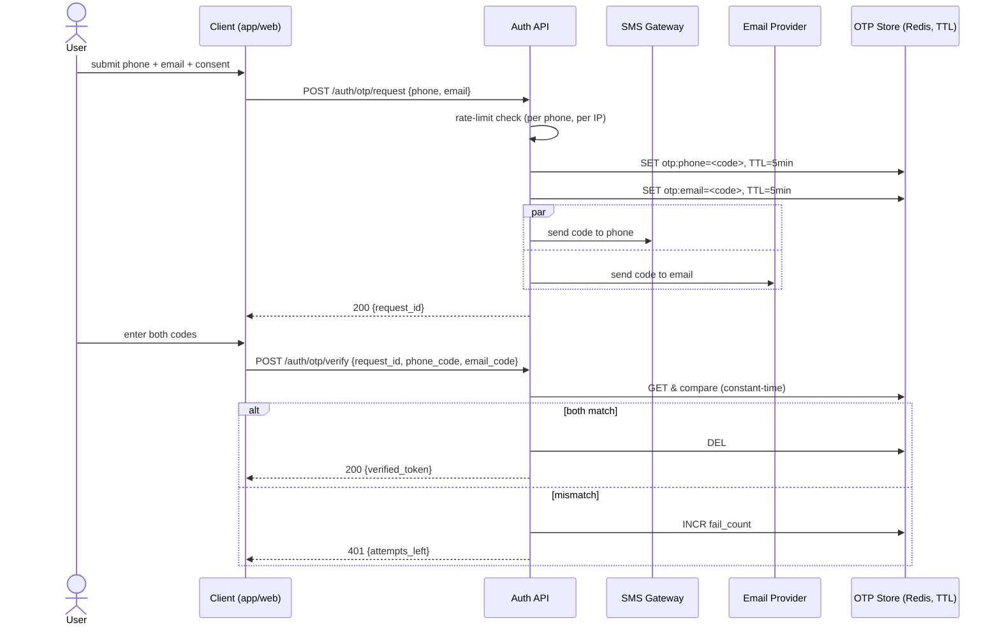

# Pattern — OTP authentication (phone + email)

Reusable pattern for KYC-lite flows: registration, password reset, sensitive transaction re-auth.

## When to use
- Customer-facing apps where full KYC is overkill
- Markets where SMS + email are ubiquitous (TH, SEA)

## Canonical sequence

## Rules of thumb

| Concern | Recommendation |
|---|---|
| Code length | 6 digits numeric (balance usability vs entropy) |
| TTL | 5 minutes |
| Retry limit | 3 attempts per request; 3 requests per 15 min per phone |
| Delivery parallel | send SMS + email in parallel; don't block on SMS gateway |
| Idempotency | `request_id` unique per OTP session |
| Storage | Redis with EXPIRE, never in primary DB |
| Comparison | constant-time, never log the code |
| Rollout pauses | circuit-breaker on SMS gateway failure → fallback to email-only with UX note |

## PDPA notes
- OTP itself is not PII but phone/email are → storage policy applies
- Consent capture **must** happen **before** OTP send (otherwise processing without lawful basis)

## Anti-patterns to avoid
- Single OTP for both channels → weaker than two-channel; pick one or do two
- OTP in URL query string → leaks in logs/referrers
- No rate limit → SMS flooding / cost attack
- Logging OTP for "debugging" → compliance breach

## Related
- `library/patterns/consent-capture.md` (to be added)
- SRS Thai template §3.2 FR-001
