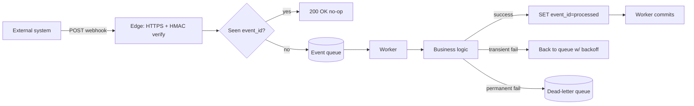

# Pattern — Inbound webhook integration (idempotent, retry-safe)

Reusable for any external system that pushes events to us (POS transactions, payment callbacks, shipment updates).

## Problem
External systems retry on failure. Without idempotency, we double-process. Without verification, we trust arbitrary callers. Without dead-letter, a malformed event poisons the queue.

## Canonical design

## Contract with external system

| Concern | Requirement |
|---|---|
| Auth | HMAC-SHA256 signature header (`X-Signature`) with shared secret; reject if mismatch |
| Idempotency | Require unique `event_id` in payload (fail if missing) |
| Response | Return 2xx fast (≤ 500ms) — push work to queue |
| Retry behavior | Ack 2xx even on duplicates; return 5xx only for genuinely unprocessable (not for dedupe) |
| Ordering | Don't assume FIFO; include `occurred_at` timestamp in payload |

## Implementation checklist

- [ ] HMAC verification (constant-time compare)
- [ ] Replay protection: reject events older than N minutes
- [ ] Idempotency store: `SET event_id EX 7days NX` → true = first time
- [ ] Queue-backed (SQS / RabbitMQ / Redis Streams) — don't process inline
- [ ] Worker retries with exponential backoff: 1s, 5s, 30s, 5min, 1h
- [ ] DLQ after N failures (default 5) with alert
- [ ] Observability: metrics on receive rate, processing lag, DLQ depth
- [ ] Audit log of every event (masked payload) for traceability
- [ ] Admin tool: re-drive from DLQ

## Anti-patterns
- Sync processing inline with HTTP response → slow responses → external system retries → amplified load
- Idempotency by "hash of payload" → fragile if external system fixes typo and resends
- Silent discard of invalid events → support nightmare; use DLQ + alert

## Related
- SRS Thai template §3.2 FR-007 (POS integration example)
- `library/patterns/auth-otp-flow.md` for outbound notifications
