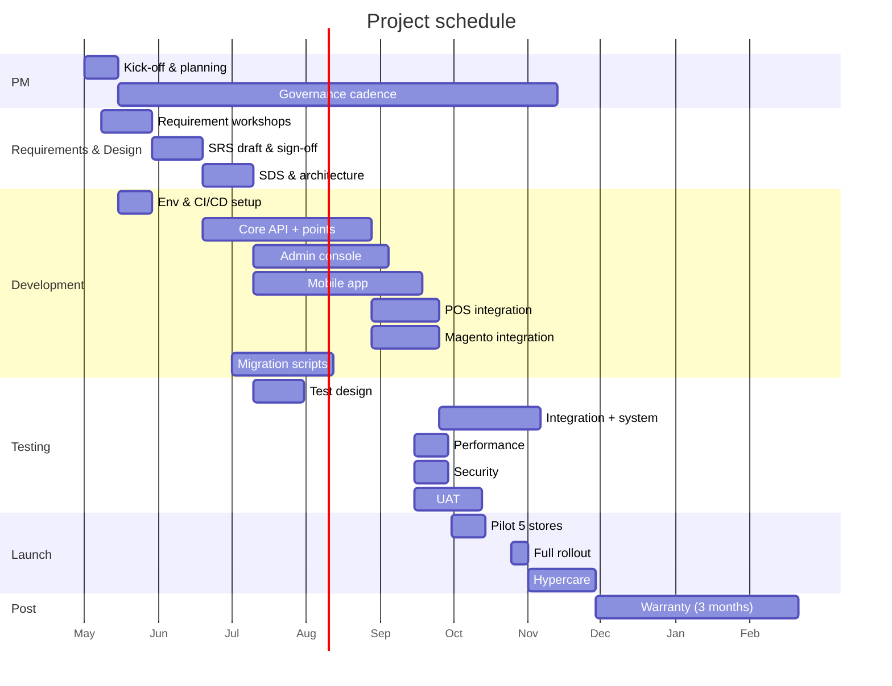

# Work Breakdown Structure + Project Schedule

**โครงการ:** [ชื่อโครงการ]
**เวอร์ชัน:** 0.1
**วันที่:** [YYYY-MM-DD]
**PM:** [ชื่อ]

---

## 1. สรุป
- **Duration:** [start → end]
- **Team size:** [FTE breakdown]
- **Major milestones:** [M1, M2, ... จาก SOW §7]

## 2. WBS Tree (outline)

> เลข WBS แบบ dotted (1, 1.1, 1.1.1)

- 1. Project Management
  - 1.1 Planning & kick-off
  - 1.2 Governance (steering meeting, status report)
  - 1.3 Change management
  - 1.4 Risk management
  - 1.5 Closure
- 2. Requirements & Design
  - 2.1 SOW review + requirement workshops
  - 2.2 SRS draft → sign-off
  - 2.3 SDS / architecture → sign-off
  - 2.4 UX / wireframe / design system alignment
- 3. Development
  - 3.1 Environment setup (AWS, CI/CD, GitLab)
  - 3.2 Core API + points engine
  - 3.3 Admin console
  - 3.4 Mobile app (iOS/Android)
  - 3.5 Integration (POS webhook)
  - 3.6 Integration (Magento)
  - 3.7 Dashboard + 360° view
  - 3.8 Data migration scripts
- 4. Testing
  - 4.1 Test plan + test case design
  - 4.2 Unit + integration
  - 4.3 System / E2E
  - 4.4 Performance / load
  - 4.5 Security scan
  - 4.6 UAT support
- 5. Deployment & Launch
  - 5.1 Pilot deployment (5 stores)
  - 5.2 Pilot monitoring + tuning
  - 5.3 Full rollout
  - 5.4 Go-live support (hypercare)
- 6. Post-launch
  - 6.1 Warranty (3 months)
  - 6.2 Training / knowledge transfer
  - 6.3 Runbook finalization
  - 6.4 Handover

## 3. Deliverable → WBS mapping

| Deliverable (SOW §4) | WBS package(s) |
|---|---|
| PM plan | 1.1 |
| SRS | 2.1–2.2 |
| SDS | 2.3 |
| Source code + CI/CD | 3.1–3.8 |
| Mobile app published | 3.4 + 5.1 |
| Admin console | 3.3 |
| Migration scripts + report | 3.8 |
| UAT plan + sign-off | 4.1 + 4.6 |
| Runbook + training | 6.2–6.3 |
| 3-month warranty | 6.1 |

## 4. Schedule (Gantt)

## 5. Resource plan

| Role | FTE | Period |
|---|---|---|
| PM | 0.5 | full project |
| Tech Lead | 1 | full |
| Backend dev | 2 | M1-M5 |
| Mobile dev | 2 | M2-M5 |
| Frontend dev | 1 | M2-M4 |
| QA | 1 | M2-M5 + 1 warranty |
| DevOps | 0.5 | full |
| BA/SA | 1 | M1-M3 |

## 6. Dependencies & risks

| # | Dependency / risk | Impact if slipped | Mitigation |
|---|---|---|---|
| D1 | API access from client ≤ 2 weeks | +2–4 weeks to M1 | ขอ sandbox ล่วงหน้า |
| D2 | Tier rule confirmation (SRS Q1) | +1 week to SDS | workshop week 2 |

## 7. Payment milestones (จาก SOW §10)

| % | Trigger |
|---|---|
| 20 | Contract sign |
| 20 | M1 sign-off |
| 20 | M2 sign-off |
| 20 | M4 pilot |
| 20 | M5 go-live |

## 8. Revision History
