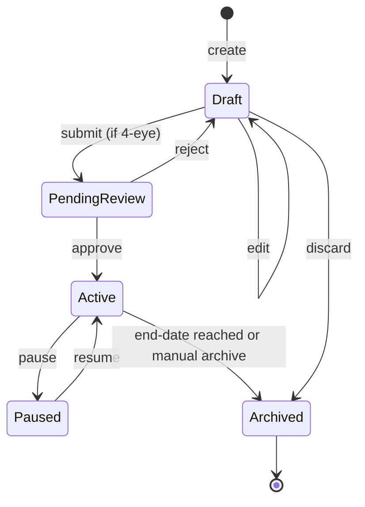

# Pattern — CRUD admin entity (list / detail / form / audit)

Boilerplate pattern for "marketing ตั้งค่าได้เอง" style admin UIs — earn rules, redemption catalog, campaigns, users, etc.

## Screens (standard set)

1. **List view** — table, filter, search, paginate, column sort
2. **Detail view** — read-only, with "edit" + "audit trail" actions
3. **Form** — create / edit (same form, mode differs)
4. **Delete confirmation** — soft-delete by default
5. **Audit log** — who changed what, when, diff

## Entity lifecycle

## API conventions

| Action | Method | Path | Notes |
|---|---|---|---|
| List | GET | /v1/<entity> | ?filter=...&page=... |
| Get | GET | /v1/<entity>/:id | includes audit link |
| Create | POST | /v1/<entity> | 201 + Location header |
| Update | PATCH | /v1/<entity>/:id | partial; require If-Match for optimistic concurrency |
| Archive | DELETE | /v1/<entity>/:id | soft-delete |
| Audit | GET | /v1/<entity>/:id/audit | paginated |

## Validation & governance

- **Schema validation** server-side (don't trust UI)
- **Role check:** can-create / can-approve / can-view-audit separately
- **4-eye principle** for high-impact entities (earn rules, campaigns w/ > N members) → require second approver
- **Optimistic concurrency:** return `ETag`, require `If-Match` on update; conflict → 412
- **Audit record:** capture `actor, action, entity_id, before, after, at, reason(optional)`

## UX notes

- Form: group fields logically (sections), show active/pending preview
- Rule entities: "test this rule" sandbox button → evaluate against last N transactions without committing
- Campaigns: dry-run (count how many members will be affected) before activating
- Inline validation, save draft, don't lose work on accidental navigation

## Anti-patterns
- One giant "save" button that commits changes to live traffic without a staging/preview
- No audit trail on config changes → nightmare for incident RCA
- Hard-delete → can't explain historical reports that reference deleted configs

## Related
- Admin console SRS sections (FR-006 example in SRS template)
- `patterns/webhook-integration.md` — if CRUD changes trigger downstream sync
