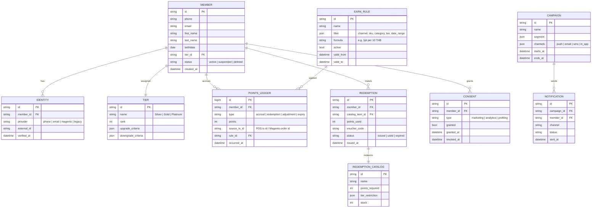

# ERD — Loyalty Platform (conceptual)

## Notes
- `POINTS_LEDGER` is the source of truth (no aggregated `points_balance` column — derive)
- `IDENTITY` supports multi-provider linking (POS / Magento / legacy / phone / email)
- `CONSENT` is PDPA-first — separate record per consent type, with grant/revoke timestamps
- TBDs flagged in SRS §3.2 FR-004 (tier criteria) reflected as `json` blobs here until rules are confirmed
