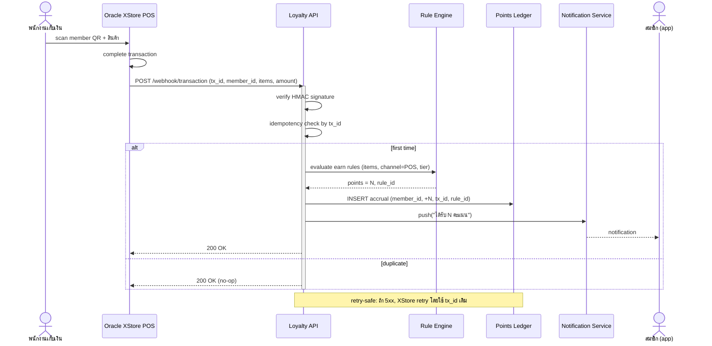

# Sequence — Points accrual from POS transaction

## Edge cases (ต้องครอบคลุมใน implementation)
- Member-less transaction (ไม่มี member_id ใน payload) — ไม่ทำอะไร, ตอบ 200
- Rule inactive หรือไม่ match — บันทึก attempt แต่ไม่ออกคะแนน, log reason
- Member suspended — skip accrual, log
- Partial refund (transaction void / refund event) — reverse ledger entry ตาม tx_id
