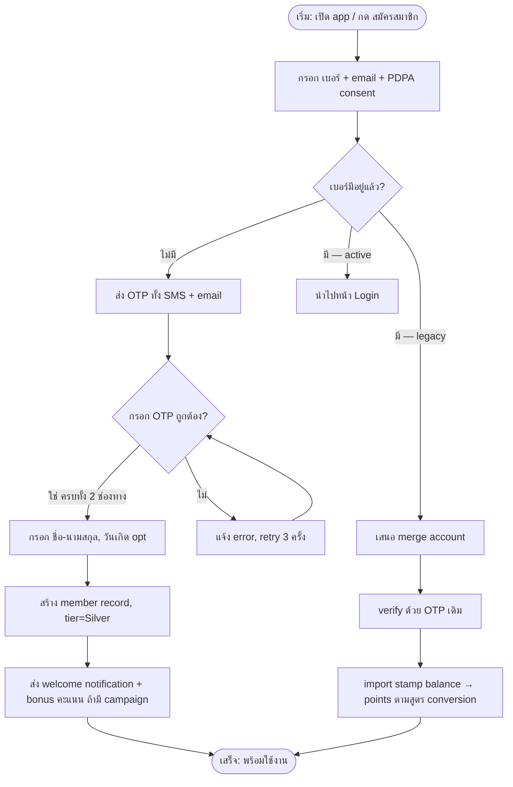

# Workflow — Member onboarding (new registration)

## Notes
- PDPA consent จับเป็น record แยกต่อ type (ดู ERD `CONSENT`)
- สูตร conversion stamp → points [TBD: FR-011] ยังไม่ระบุ — placeholder จนกว่าจะยืนยัน
- Retry cap 3 ครั้งต่อ session; เกินให้รอ 15 นาที (anti-abuse)
