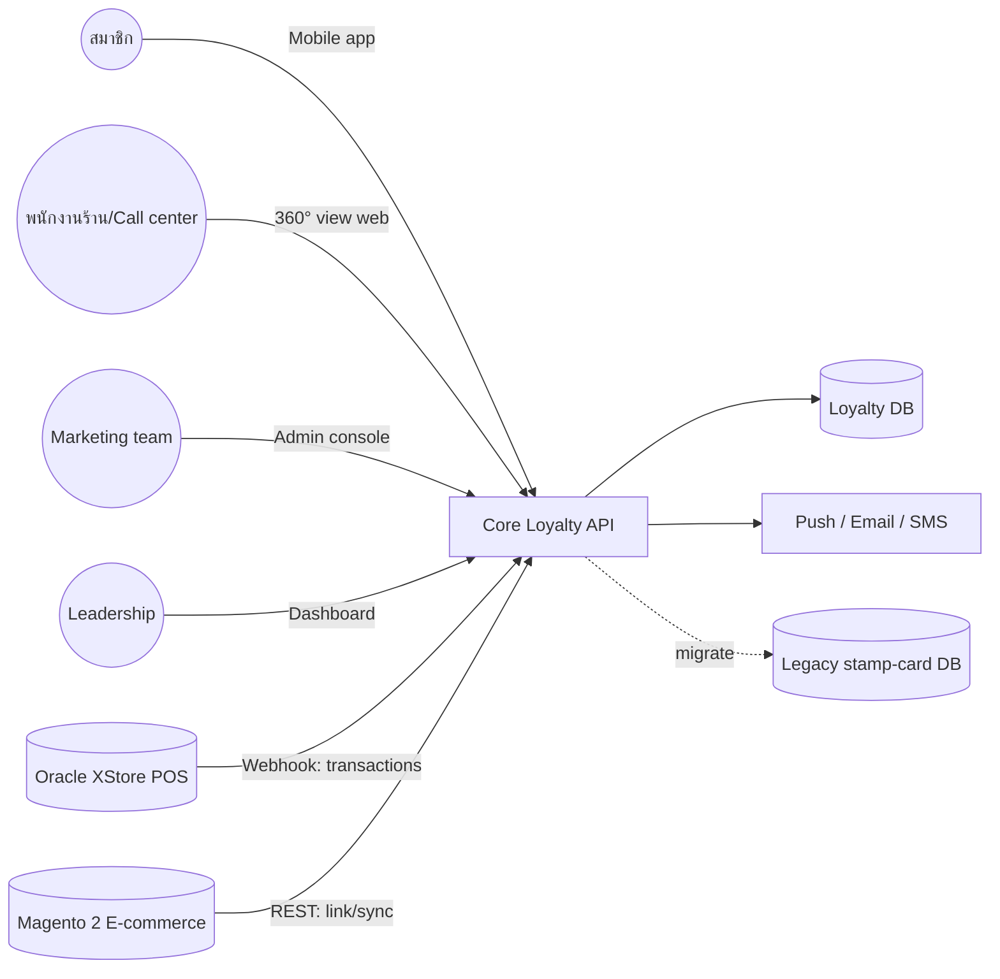

# เอกสารข้อกำหนดความต้องการซอฟต์แวร์ (Software Requirements Specification)

**โครงการ:** ACME Retail Loyalty Program Platform
**ลูกค้า:** ACME Retail Co., Ltd.
**เวอร์ชัน:** 0.1 (draft)
**วันที่:** 2026-04-13
**ผู้จัดทำ:** 2Smooth Co., Ltd.

---

## 1. บทนำ

### 1.1 วัตถุประสงค์
เอกสารนี้ระบุข้อกำหนดความต้องการของระบบ ACME Retail Loyalty Program Platform ทั้งในด้าน functional และ non-functional สำหรับใช้เป็นข้อตกลงร่วมระหว่าง ACME (ผู้ว่าจ้าง) และ 2Smooth (vendor) และเป็น input สำหรับการออกแบบระบบ (SDS), พัฒนา, ทดสอบ, และรับมอบงาน

**กลุ่มผู้อ่านเป้าหมาย:** Product Owner, IT counterpart ฝั่งลูกค้า, ทีมพัฒนา, QA, Ops

### 1.2 ขอบเขต
**ชื่อระบบ:** ACME Loyalty Platform
**สิ่งที่ระบบจะทำ:**
- รวม customer identity ข้าม POS, e-commerce, mobile app
- ออก/ใช้ points พร้อม rule engine ที่ตั้งค่าได้
- Member mobile app (iOS/Android) + Admin web console
- Integrate กับ Oracle XStore (POS) และ Magento 2 (e-commerce)
- Migrate สมาชิกเดิม ~180,000 ราย
- Dashboard สำหรับ leadership

**สิ่งที่ไม่อยู่ในขอบเขต:**
- การเปลี่ยน POS
- External loyalty partnerships, gamification, AI personalization (จัดเป็น phase 2)

**ประโยชน์ทางธุรกิจ:** unified customer view, marketing agility (ตั้ง rule ได้เอง), เตรียม Q4 peak season

### 1.3 นิยามศัพท์และตัวย่อ
| คำศัพท์ | ความหมาย |
|---|---|
| POS | Point of Sale (ระบบคิดเงินหน้าร้าน) — ใช้ Oracle Retail XStore |
| Points engine | Service คำนวณการได้/ใช้คะแนนตาม rule |
| Tier | ระดับสมาชิก: Silver / Gold / Platinum |
| PDPA | พ.ร.บ. คุ้มครองข้อมูลส่วนบุคคล (พ.ศ. 2562) |
| KYC lite | การยืนยันตัวตนระดับเบื้องต้น (phone + email OTP) |
| OTP | One-Time Password |
| SRS | Software Requirements Specification |
| SDS | Software Design Specification |
| CR | Change Request |

### 1.4 เอกสารอ้างอิง
- SOW: `projects/sample-loyalty/_input/raw/sow-acme-loyalty.md`
- SOW extract: `projects/sample-loyalty/_input/extracted.md`
- มาตรฐาน: IEEE Std 830-1998 (pragmatic subset)
- กฎหมาย: พ.ร.บ. คุ้มครองข้อมูลส่วนบุคคล พ.ศ. 2562 (PDPA)

### 1.5 ภาพรวมของเอกสาร
- §2 ภาพรวมระบบ (context, users, constraints)
- §3 ข้อกำหนดเฉพาะ (external interfaces, FR, NFR)
- §4 ภาคผนวก (diagrams, wireframe refs)

---

## 2. ภาพรวมของระบบ

### 2.1 มุมมองต่อผลิตภัณฑ์
ระบบเป็นระบบ **ใหม่** (ทดแทน stamp-card เดิม) ประกอบด้วย 3 ส่วนหลัก: Member Mobile App, Admin Web Console, Core Loyalty Service (API + points engine) — เชื่อมต่อกับระบบเดิมของ ACME ผ่าน REST

**System context:**

### 2.2 ฟังก์ชันของผลิตภัณฑ์ (สรุประดับสูง)
- F1: Member registration + identity unification
- F2: Points accrual (configurable rules)
- F3: Points redemption (catalog + rules)
- F4: Tier management (Silver/Gold/Platinum)
- F5: Member mobile app (card, history, coupon, locator)
- F6: Admin console (campaign, rules)
- F7: POS + e-commerce integration
- F8: 360° customer view
- F9: Leadership dashboard
- F10: Data migration from legacy
- F11: Campaign/notification distribution

### 2.3 คุณลักษณะของผู้ใช้
| บทบาท | คำอธิบาย | ระดับสิทธิ์ |
|---|---|---|
| Member (สมาชิก) | ลูกค้าทั่วไป, ใช้ mobile app | Self-service |
| Store staff | พนักงานหน้าร้าน, ใช้ 360° view | Read customer + issue points manually (fallback) |
| Call center agent | ใช้ 360° view + CRUD limited (reset password, adjust points ตาม policy) | Supervised write |
| Marketing admin | ตั้งค่า campaign, earn rule, promotion | Full admin on marketing scope |
| System admin | จัดการ user, role, config | Superuser |
| Leadership | ดู dashboard | Read-only |

### 2.4 ข้อจำกัด
- **Deploy:** AWS ap-southeast-1 (ACME's account)
- **Integration:** Oracle XStore REST webhook, Magento 2 REST API
- **Compliance:** PDPA (ไทย)
- **Budget:** 2.4M THB fixed-price
- **Schedule:** go-live 2026-10-31 (Q4 peak season constraint)
- **Change control:** >5 man-days → CR via Steering Committee

### 2.5 สมมติฐานและการพึ่งพา
- ACME ส่งมอบ API access (POS + Magento) ภายใน 2 สัปดาห์หลังเซ็นสัญญา — **delay = schedule risk**
- ACME ส่ง legacy DB dump + schema documentation
- ACME มี brand/design system พร้อมส่งมอบ [ต้องยืนยัน: มีอยู่แล้วหรือไม่]
- ACME มี App Store + Google Play developer account [ต้องยืนยัน]
- เนื้อหาไทยทั้งหมด (marketing copy, notifications) มาจาก ACME

---

## 3. ข้อกำหนดเฉพาะ

### 3.1 External Interfaces

#### 3.1.1 User Interfaces
- **Member mobile app:** iOS 15+ / Android 10+; ภาษาไทยเป็นหลัก, English เป็น option; ต้อง align กับ ACME brand guideline [ต้องยืนยัน]
- **Admin web console:** responsive (desktop primary); Thai UI; role-based menu
- **360° customer view:** web app; Thai UI; embedded in existing staff portal [ต้องยืนยัน: มีอยู่แล้วหรือไม่]
- **Leadership dashboard:** web; charts (members, points, GMV); realtime vs daily batch [TBD-confirm]

#### 3.1.2 Hardware Interfaces
N/A (cloud-hosted)

#### 3.1.3 Software Interfaces
- **Oracle Retail XStore:** webhook outbound (transaction events) → Loyalty API endpoint. Format: JSON. Auth: signed HMAC [ต้องยืนยัน: method auth]
- **Magento 2:** REST API (Magento เป็น provider), Loyalty service consume. OAuth 2 bearer tokens
- **Push:** FCM + APNS (หรือผ่าน 3rd-party เช่น OneSignal) [TBD: เลือก provider]
- **Email:** SMTP / transactional email provider [TBD: SendGrid / AWS SES / อื่น]
- **SMS (ถ้า in scope):** Thai SMS gateway [TBD: provider + cost ownership]

#### 3.1.4 Communication Interfaces
- HTTPS only (TLS 1.2+) สำหรับ API ทั้งหมด
- JSON over REST
- Webhook with retry + idempotency key

### 3.2 Functional Requirements

> รหัส `FR-xxx` สอดคล้องกับ `extracted.md §5`; แต่ละข้อมี priority (M=Must, S=Should, C=Could)

#### FR-001 Customer registration (KYC lite)
- **Priority:** M
- **คำอธิบาย:** สมาชิกสมัครผ่าน mobile app หรือ web ด้วยเบอร์โทร + email + OTP
- **Input:** phone, email, ชื่อ-นามสกุล, วันเกิด [ต้องยืนยัน: field ที่บังคับ vs optional], PDPA consent
- **Processing:** ส่ง OTP ไปทั้ง phone (SMS) และ email; verify ทั้งคู่ก่อน activate
- **Output:** member record + member ID + initial tier (Silver default)
- **Precondition:** เบอร์ไม่ซ้ำในระบบ (ถ้าซ้ำ → flow merge identity)
- **Postcondition:** member พร้อมใช้งาน, welcome notification ส่ง

#### FR-002 Points accrual
- **Priority:** M
- **คำอธิบาย:** คำนวณคะแนนจาก transaction ที่ได้รับจาก POS/e-commerce ตาม rule ที่ marketing ตั้ง
- **Input:** transaction event (amount, SKU list, channel, member ID, store ID)
- **Processing:** match กับ active earn rules (filter: SKU/category/channel/tier/date), compute points, write to ledger
- **Output:** points credit entry; notification ถึง member (push/in-app)
- **Rules editable:** ผ่าน admin console (section 3.2.FR-006)

#### FR-003 Points redemption
- **Priority:** M
- **คำอธิบาย:** สมาชิกแลกคะแนนกับ item ใน redemption catalog หรือ discount coupon
- **Input:** member ID, redemption item ID
- **Processing:** ตรวจ balance + rule (tier-gated, date-gated), debit points, issue coupon/voucher
- **Output:** redemption record; voucher code (ใช้ที่ POS/e-commerce)

#### FR-004 Tier management
- **Priority:** M
- **คำอธิบาย:** คำนวณ tier สมาชิก (Silver/Gold/Platinum) ตามเกณฑ์ที่ตั้งไว้
- **Processing:** batch รายวัน (หรือ realtime) ตรวจเกณฑ์ → upgrade/downgrade → notify
- **[ต้องยืนยัน]** เกณฑ์: ใช้ยอดซื้อสะสม, คะแนนสะสม, หรือ visit count? ช่วง threshold เท่าไร? window กี่เดือน? downgrade ทันทีหรือ grace period?

#### FR-005 Member mobile app (features)
- **Priority:** M
- **คำอธิบาย:** บัตรสมาชิก (QR/barcode), ประวัติคะแนน, coupon wallet, store locator (map), promo feed
- **Input/Output:** ตามแต่ละหน้า

#### FR-006 Admin console — rule configuration
- **Priority:** M
- **คำอธิบาย:** UI สำหรับ marketing ตั้ง earn rule, redemption catalog, campaign, promotion โดยไม่ต้องแก้โค้ด
- **Rule DSL หรือ UI-based:** [ต้องยืนยัน: ระดับความซับซ้อน — เบื้องต้นใช้ UI form; ถ้า rule ซับซ้อนมาก อาจต้อง DSL]
- **Audit:** ทุกการเปลี่ยนแปลง rule บันทึก audit log

#### FR-007 POS integration
- **Priority:** M
- **คำอธิบาย:** รับ webhook จาก Oracle XStore เมื่อเกิด transaction ที่มี member ID → ทริกเกอร์ accrual
- **Reliability:** idempotent (ใช้ transaction ID เป็น key), retry-safe, dead-letter queue สำหรับ event ที่ประมวลผลไม่ได้

#### FR-008 E-commerce integration (Magento 2)
- **Priority:** M
- **คำอธิบาย:** link Magento customer กับ loyalty member; sync transaction → accrual; ใช้ voucher ที่ออกจากระบบ loyalty กับ Magento checkout
- **[ต้องยืนยัน]** วิธี link identity — ใช้ email + phone match? ต้องทำ UI confirm?

#### FR-009 360° customer view
- **Priority:** S
- **คำอธิบาย:** หน้าจอสำหรับ staff/call center แสดง member profile, tier, points, transaction history, active vouchers, contact log
- **[ต้องยืนยัน]** deploy เป็น standalone web หรือ embed ใน staff portal เดิม

#### FR-010 Leadership dashboard
- **Priority:** S
- **คำอธิบาย:** widgets: members count (total/active), points issued/redeemed (daily/monthly), GMV from members, tier distribution
- **Refresh cadence:** [TBD-confirm: realtime vs daily] — แนะนำ daily batch สำหรับ cost-effective

#### FR-011 Data migration
- **Priority:** M
- **คำอธิบาย:** import ~180k records จาก legacy stamp-card DB → loyalty schema
- **Processing:** cleansing (dedupe by phone), map stamp balance → starting points [ต้องยืนยัน: สูตร conversion], migration report (count matched, unmatched, errors)
- **Acceptance:** 100% record count match, spot-check 200 records

#### FR-012 Campaign / notification distribution
- **Priority:** S
- **คำอธิบาย:** marketing สร้าง campaign → ส่ง push / email / in-app / SMS [ต้องยืนยัน channels] ตาม segment
- **Segment:** by tier, last-active, location, custom attribute

### 3.3 Non-Functional Requirements

| หมวด | ข้อกำหนด | ที่มา |
|---|---|---|
| Performance (capacity) | รองรับ 500,000 members | SOW §6 |
| Performance (throughput) | ≥ 50 points-tx/sec ที่ peak | SOW §6 |
| Performance (mobile — **ต้องยืนยัน quantify**) | เสนอ: cold-start ≤ 3s, screen transition ≤ 500ms, API P95 ≤ 800ms | SOW §6 ("responsive and fast") |
| Availability (admin) | Mon-Sat 08:00-22:00 ICT | SOW §6 |
| Availability (member-facing) | 24/7; **เสนอ SLA 99.5%** [ต้องยืนยัน] | SOW §6 |
| Security | PDPA compliance; ไม่มี critical/high ใน security scan | SOW §6, §9 |
| Security (data) | Encryption at rest + in transit; PII masking in logs | IEEE 830 good practice |
| Compliance | PDPA (consent, right to be forgotten, data retention policy) | SOW |
| Scalability | [TBD: growth projection] — แนะนำ design สำหรับ 2M members headroom | — |
| Usability | [TBD: ไม่มี explicit target — เสนอ SUS ≥ 70 ใน UAT] | — |
| Support SLA (warranty 3 เดือน) | P1 response 2h, fix 8h | SOW §6 |
| Data retention | [ต้องยืนยัน: นโยบาย retention สำหรับ inactive accounts] | PDPA consideration |

### 3.4 Design Constraints
- ต้อง deploy บน AWS ap-southeast-1, ACME's account
- REST/JSON สำหรับ integration ทั้งหมด
- Source code บน GitLab (ACME's หรือ vendor's — [ต้องยืนยัน])
- ภาษาเอกสาร: Thai primary

### 3.5 Software System Attributes (สรุป)
- Reliability: webhook ต้อง idempotent + retryable; no-lost-transaction guarantee (at-least-once + dedupe)
- Maintainability: rule engine แยกจาก business logic; admin เปลี่ยน rule ได้โดยไม่ deploy
- Portability: cloud-native, ถ้าย้าย region อื่นในอนาคตต้องทำได้

---

## 4. ภาคผนวก

### 4.1 High-level architecture (placeholder)
> จะระบุละเอียดใน SDS. เบื้องต้นดู diagram ใน §2.1

### 4.2 ERD (outline)
> จะวาดใน `projects/sample-loyalty/diagram/erd-loyalty.md` ผ่าน skill `make-diagram`

### 4.3 เอกสารแนบ
- SOW ต้นฉบับ: `_input/raw/sow-acme-loyalty.md`
- SOW extract: `_input/extracted.md`

---

## 5. ประวัติการแก้ไข

| เวอร์ชัน | วันที่ | ผู้แก้ไข | รายการเปลี่ยนแปลง |
|---|---|---|---|
| 0.1 | 2026-04-13 | 2Smooth | Initial draft จาก SOW extract |

---

## Draft report (จาก skill draft-doc)

- **Sections filled:** 24
- **Inferred (ต้องยืนยัน):** 8 — tier logic, push provider, mobile perf targets, uptime SLA, brand guideline, identity link method, dashboard refresh, GitLab ownership
- **TBDs:** 4 — growth projection, usability target, data retention policy, registration mandatory fields
- **Next:** run `qa-review` on this doc to generate client question list + risk register
