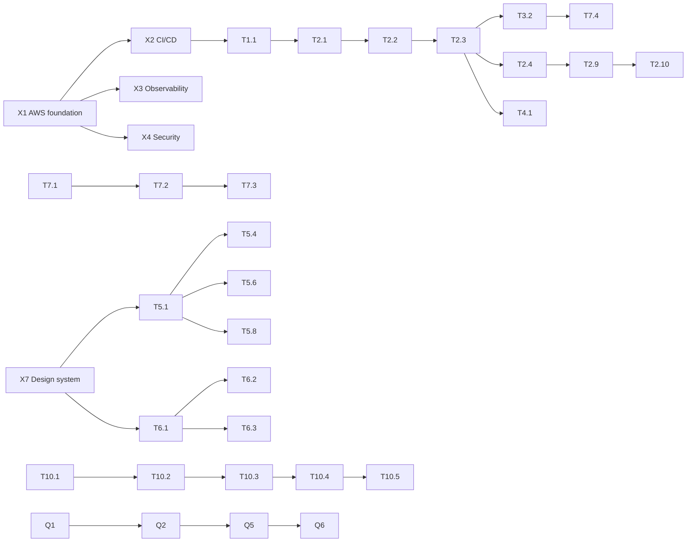
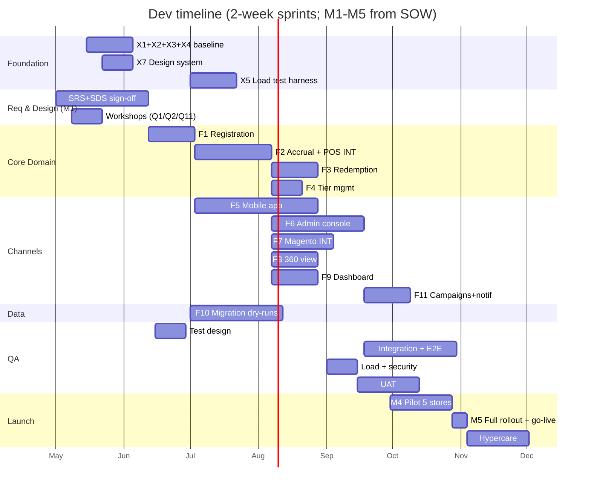

# Development task backlog — sample-loyalty

> **⚠ PROVISIONAL** — generated against unsigned SRS v0.1 as a fixture example.
> **Re-run `plan-tasks` after client sign-off** to produce the canonical `dev-tasks.md`.
> See SRS QA review (qa/srs-review-2026-04-13.md) — 5 blocking client questions still open; several tasks here will shift once answered.

## Summary
- **FRs decomposed:** 12 (FR-001..FR-012)
- **Total tasks:** 102 (78 feature, 14 ops/cross-cutting, 10 QA & migration)
- **Estimated effort:** ~48 person-weeks
- **Critical path:** ~22 weeks — OPS baseline → Registration + Accrual (F1+F2) → POS integration → Mobile beta → UAT → Pilot → Rollout
- **Iterations:** 12 × 2-week sprints fit within M1-M5 (2026-05-15 → 2026-10-31)

---

## Module F1 — Customer registration (FR-001)

| # | Task | Type | Role | Size | Est. (h) | Depends on | Notes |
|---|---|---|---|---|---:|---|---|
| T1.1 | Design: OTP API contract, DB schema (MEMBER, IDENTITY, CONSENT) | DSG | TL | S | 12 | X1 | ref `patterns/auth-otp-flow`, ERD §4.2 |
| T1.2 | BE: OTP request endpoint + rate limit | BE | BE1 | S | 12 | T1.1 | Redis TTL 5min, 3 req/15min |
| T1.3 | BE: OTP verify endpoint (constant-time compare) | BE | BE1 | S | 10 | T1.2 | fail counter + lockout |
| T1.4 | INT: SMS gateway (provider TBD — Q5) | INT | BE1 | S | 8 | T1.2 | circuit-breaker fallback |
| T1.5 | INT: Email transactional send | INT | BE2 | XS | 4 | T1.2 | |
| T1.6 | MO: Registration + OTP input screens (iOS + Android) | MO | MO1+MO2 | M | 24 | T1.1 | two-field OTP UX |
| T1.7 | BE: PDPA consent capture + storage | BE | BE2 | S | 10 | T1.1 | ref `patterns/consent-capture` (to build) |
| T1.8 | Unit tests (registration module) | TST | BE1 | XS | 6 | T1.3, T1.7 | |
| T1.9 | E2E: happy path + invalid OTP + dup phone | E2E | QA | S | 8 | T1.3, T1.4, T1.5, T1.6 | |
| T1.10 | DOC: Registration API + user flow | DOC | BE1 | XS | 3 | T1.3 | |

**Module totals:** 10 tasks · ~97h

---

## Module F2 — Points accrual (FR-002, FR-007)

| # | Task | Type | Role | Size | Est. (h) | Depends on | Notes |
|---|---|---|---|---|---:|---|---|
| T2.1 | Design: Rule engine DSL + schema (EARN_RULE, POINTS_LEDGER, EVENT_LOG) | DSG | TL | M | 20 | T1.1 | append-only ledger, idempotency by tx_id |
| T2.2 | BE: Rule evaluation engine (filter + formula) | BE | BE1 | M | 32 | T2.1 | |
| T2.3 | BE: Accrual service (write to ledger, emit events) | BE | BE2 | S | 16 | T2.2 | at-least-once + dedupe |
| T2.4 | INT: POS webhook receiver (HMAC verify, dedupe, queue) | INT | BE2 | M | 24 | T2.1, X4 | ref `patterns/webhook-integration` |
| T2.5 | OPS: Event queue setup (SQS / Redis Streams) + DLQ | OPS | DevOps | S | 12 | X1 | |
| T2.6 | BE: Worker to consume queue + call accrual service | BE | BE2 | S | 12 | T2.3, T2.5 | exponential backoff |
| T2.7 | MO: Notification receive ("ได้รับ N คะแนน") | MO | MO1 | XS | 4 | T2.3, T5.3 | push trigger |
| T2.8 | Unit tests (rule engine) | TST | BE1 | S | 8 | T2.2 | |
| T2.9 | Integration test: full POS → ledger → notification | TST | BE2+QA | S | 12 | T2.6, T5.3 | |
| T2.10 | E2E: transaction → points displayed in app | E2E | QA | S | 8 | T2.9, T5.1 | |
| T2.11 | DOC: rule configuration guide for marketing | DOC | BA | S | 8 | T2.2 | Thai |

**Module totals:** 11 tasks · ~156h

---

## Module F3 — Redemption (FR-003)

| # | Task | Type | Role | Size | Est. (h) | Depends on | Notes |
|---|---|---|---|---|---:|---|---|
| T3.1 | Design: Redemption schema (REDEMPTION, REDEMPTION_CATALOG) + voucher issuance | DSG | TL | S | 12 | T2.1 | |
| T3.2 | BE: Redemption endpoint (balance check, debit, voucher issue) | BE | BE1 | S | 16 | T3.1, T2.3 | transactional |
| T3.3 | BE: Voucher validation endpoint (for POS/Magento to consume) | BE | BE1 | S | 12 | T3.2 | |
| T3.4 | INT: Magento 2 voucher redemption hook | INT | BE2 | M | 20 | T3.3, T7.1 | |
| T3.5 | MO: Redemption catalog + wallet screens | MO | MO2 | M | 20 | T3.1 | |
| T3.6 | Admin UI: Catalog CRUD (ties to F6) | FE | FE1 | S | 16 | T6.1 | ref `patterns/crud-admin-entity` |
| T3.7 | Unit + integration tests | TST | BE1 | S | 8 | T3.3 | |
| T3.8 | E2E: redeem → voucher used at POS | E2E | QA | S | 8 | T3.4, T7.4 | |

**Module totals:** 8 tasks · ~112h

---

## Module F4 — Tier management (FR-004) — **⚠ BLOCKED by client Q1**

| # | Task | Type | Role | Size | Est. (h) | Depends on | Notes |
|---|---|---|---|---|---:|---|---|
| T4.0 | ⚠ WORKSHOP: Resolve tier criteria (upgrade/downgrade rules) | DSG | TL+BA | S | 8 | — | Blocks T4.1; target sprint 2 |
| T4.1 | Design: Tier logic + TIER entity + scheduling | DSG | TL | S | 12 | T4.0 | |
| T4.2 | BE: Tier evaluation service (nightly batch by default) | BE | BE2 | S | 12 | T4.1 | |
| T4.3 | BE: Tier change notification + event emission | BE | BE2 | XS | 4 | T4.2 | |
| T4.4 | Admin UI: view/override member tier | FE | FE1 | XS | 4 | T4.1, T6.1 | |
| T4.5 | Unit tests | TST | BE2 | XS | 4 | T4.2 | |
| T4.6 | E2E: batch run → tier change → member sees update | E2E | QA | XS | 4 | T4.2, T5.1 | |

**Module totals:** 7 tasks · ~48h (could balloon to M across the board depending on T4.0 outcome)

---

## Module F5 — Member mobile app (FR-005)

| # | Task | Type | Role | Size | Est. (h) | Depends on | Notes |
|---|---|---|---|---|---:|---|---|
| T5.1 | MO: App shell (navigation, theming, auth state) — iOS | MO | MO1 | M | 32 | T1.1, X7 | brand guideline required (Q6) |
| T5.2 | MO: App shell — Android | MO | MO2 | M | 32 | T1.1, X7 | |
| T5.3 | MO: Push notification infra (FCM/APNS or provider) | MO | MO1+MO2 | S | 16 | T5.1, T5.2 | Q5 pending |
| T5.4 | MO: Card screen (QR/barcode) | MO | MO1 | S | 12 | T5.1 | |
| T5.5 | MO: Transaction history screen | MO | MO2 | S | 12 | T5.2, T2.3 | |
| T5.6 | MO: Coupon wallet screen | MO | MO1 | S | 12 | T5.1, T3.2 | |
| T5.7 | MO: Store locator (map integration) | MO | MO2 | S | 12 | T5.2 | need store dataset |
| T5.8 | MO: Promo feed / campaign view | MO | MO1 | S | 16 | T5.1, T12.1 | |
| T5.9 | MO: Release process — TestFlight + Internal track | OPS | DevOps+MO | S | 8 | T5.1, T5.2 | Q7 pending |
| T5.10 | E2E on device matrix | E2E | QA | M | 24 | all T5.x | iOS 15+, Android 10+ |

**Module totals:** 10 tasks · ~176h

---

## Module F6 — Admin web console (FR-006)

| # | Task | Type | Role | Size | Est. (h) | Depends on | Notes |
|---|---|---|---|---|---:|---|---|
| T6.1 | FE: Admin shell (auth, role-based nav, i18n Thai) | FE | FE1 | S | 16 | T1.1, X7 | |
| T6.2 | FE: Earn rule editor (form + dry-run preview) | FE | FE1 | M | 24 | T6.1, T2.2 | `patterns/crud-admin-entity` |
| T6.3 | FE: Campaign builder (segment + channel + schedule) | FE | FE1 | M | 24 | T6.1, T12.1 | |
| T6.4 | FE: Audit log viewer | FE | FE1 | S | 12 | T6.1, X6 | |
| T6.5 | BE: Admin APIs (CRUD + audit + 4-eye approval) | BE | BE2 | M | 20 | T6.1 | |
| T6.6 | E2E: marketing user journey (create rule → simulate → activate → see results) | E2E | QA | S | 12 | T6.2 | |

**Module totals:** 6 tasks · ~108h

---

## Module F7 — E-commerce integration (FR-008)

| # | Task | Type | Role | Size | Est. (h) | Depends on | Notes |
|---|---|---|---|---|---:|---|---|
| T7.0 | ⚠ WORKSHOP: Identity merge strategy (Q2) | DSG | TL+BA | S | 8 | — | Blocks T7.1 |
| T7.1 | Design: Magento ↔ loyalty identity link + sync | DSG | TL | S | 12 | T7.0 | |
| T7.2 | INT: Magento customer sync (poll or webhook) | INT | BE2 | M | 24 | T7.1 | |
| T7.3 | INT: Order → accrual mapping | INT | BE2 | S | 16 | T7.2, T2.3 | |
| T7.4 | INT: Voucher usage callback from Magento | INT | BE2 | S | 12 | T3.3 | |
| T7.5 | E2E: online purchase → points accrued → voucher redeemed | E2E | QA | S | 12 | T7.3, T7.4 | |

**Module totals:** 6 tasks · ~84h

---

## Module F8 — 360° customer view (FR-009)

| # | Task | Type | Role | Size | Est. (h) | Depends on | Notes |
|---|---|---|---|---|---:|---|---|
| T8.0 | ⚠ CONFIRM: standalone vs embed in staff portal (Q8) | DSG | TL+BA | XS | 2 | — | Affects T8.2 scope |
| T8.1 | Design: 360° data aggregation + read model | DSG | TL | S | 10 | T8.0 | |
| T8.2 | FE: Customer profile page (tier, points, history, vouchers, contact log) | FE | FE1 | M | 24 | T8.0, T8.1 | |
| T8.3 | BE: Aggregation API (fan-out queries + cache) | BE | BE1 | S | 16 | T8.1 | |
| T8.4 | E2E: staff lookup scenario | E2E | QA | XS | 4 | T8.2, T8.3 | |

**Module totals:** 5 tasks · ~56h

---

## Module F9 — Leadership dashboard (FR-010)

| # | Task | Type | Role | Size | Est. (h) | Depends on | Notes |
|---|---|---|---|---|---:|---|---|
| T9.0 | ⚠ CONFIRM: refresh cadence (Q9) — daily batch vs realtime | DSG | TL | XS | 1 | — | |
| T9.1 | Design: metrics model + data pipeline (batch or stream) | DSG | TL+DevOps | S | 10 | T9.0 | |
| T9.2 | BE: metrics aggregation service | BE | BE2 | S | 16 | T9.1 | |
| T9.3 | FE: Dashboard screens (4-6 widgets) | FE | FE1 | S | 16 | T9.1, T6.1 | |
| T9.4 | E2E: dashboard numbers match ground truth | E2E | QA | XS | 4 | T9.2, T9.3 | |

**Module totals:** 5 tasks · ~47h

---

## Module F10 — Data migration (FR-011)

| # | Task | Type | Role | Size | Est. (h) | Depends on | Notes |
|---|---|---|---|---|---:|---|---|
| T10.0 | ⚠ CONFIRM: stamp → points conversion formula (Q11) | DSG | TL+BA | XS | 2 | — | Blocks T10.2 |
| T10.1 | Analysis: profile legacy data (dedupe, quality) | DSG | BE+TL | S | 12 | — | requires legacy dump |
| T10.2 | Migration scripts: transform + load | BE | BE2 | M | 24 | T10.0, T10.1 | idempotent re-runnable |
| T10.3 | Dry-run + reconciliation report | BE | BE2+QA | S | 12 | T10.2 | spot-check 200 |
| T10.4 | Production cutover runbook + rehearsal | OPS | DevOps+TL | S | 12 | T10.3 | |
| T10.5 | Go-live migration execution | OPS | DevOps+BE2 | S | 8 | T10.4 | M5 event |

**Module totals:** 6 tasks · ~70h

---

## Module F11 — Campaign / Notifications (FR-012)

| # | Task | Type | Role | Size | Est. (h) | Depends on | Notes |
|---|---|---|---|---|---:|---|---|
| T12.0 | ⚠ CONFIRM: channels (push/email/SMS/in-app) + provider (Q5, Q13) | DSG | TL+BA | XS | 2 | — | |
| T12.1 | Design: Campaign schema + segmentation query | DSG | TL | S | 12 | T12.0 | |
| T12.2 | BE: Segmentation engine | BE | BE2 | M | 20 | T12.1 | |
| T12.3 | BE: Notification orchestrator (fan-out to channels) | BE | BE1 | S | 16 | T12.1, T5.3 | |
| T12.4 | FE: Campaign builder UI (T6.3 already) | — | — | — | — | — | see T6.3 |
| T12.5 | E2E: create campaign → members receive via all channels | E2E | QA | S | 8 | T12.3, T5.3 | |

**Module totals:** 5 tasks · ~58h

---

## Cross-cutting (NFR-driven)

| # | Task | Type | Role | Size | Est. (h) | Notes |
|---|---|---|---|---|---:|---|
| X1 | AWS foundation (VPC, IAM, RDS, ECS, ALB, Secrets Manager) | OPS | DevOps | M | 40 | Foundation — blocks all deploy |
| X2 | GitLab CI/CD pipelines (build, test, deploy per env) | OPS | DevOps | M | 24 | |
| X3 | Observability stack (CloudWatch/Datadog, centralized logs, tracing) | OPS | DevOps | M | 32 | NFR Availability |
| X4 | Security baseline (WAF, secrets, OWASP scan gate, PII masking) | OPS | DevOps | M | 32 | NFR Security |
| X5 | Load test harness (k6) — scenarios: 500k members, 50 tps | OPS | QA+DevOps | M | 32 | NFR Performance |
| X6 | Audit logging framework (all config changes, admin actions) | BE | BE2 | S | 16 | NFR Security + F6 |
| X7 | Design system / brand integration (Q6) | DSG | FE+MO | S | 16 | blocks MO + FE shells |
| X8 | PDPA compliance: retention job, right-to-be-forgotten flow | BE | BE1+TL | M | 24 | NFR Compliance (Q14) |
| X9 | i18n (Thai primary, English option) infrastructure | FE+MO | FE1+MO | S | 12 | |
| X10 | Backup / restore procedure (RPO/RTO) | OPS | DevOps | S | 12 | NFR Availability |

**Cross-cutting totals:** 10 tasks · ~240h

---

## QA & migration block

| # | Task | Type | Role | Size | Est. (h) | Notes |
|---|---|---|---|---|---:|---|
| Q1 | Test plan + test case design | QA | QA+BA | M | 40 | covers all FR/NFR |
| Q2 | UAT scripts + walkthrough sessions | QA | QA+BA | S | 16 | client-run |
| Q3 | Security scan (OWASP + dependency) — automated in CI | OPS | DevOps | XS | 4 | |
| Q4 | Security pentest (manual, 3rd party) | OPS | ext | S | — | external cost, coordinate |
| Q5 | Load test execution + report (M3/M4) | QA | QA+DevOps | S | 16 | uses X5 harness |
| Q6 | UAT sign-off ceremony | PM | PM+client | XS | 4 | |
| Q7 | Post-launch monitoring + hypercare (M5+4w) | OPS | DevOps+BE | M | 80 | warranty start |

**QA totals:** 7 tasks · ~160h (+ external pentest)

---

## Dependency DAG (high-level)

---

## Sequenced Gantt (compressed — sprint-level)

---

## Sprint allocation (12 sprints × 2 weeks)

| Sprint | Dates | Primary goals | Key tickets |
|---|---|---|---|
| S1 | 05-15 → 05-28 | Foundation + Req workshops | X1, X2, X7 start, T4.0, T7.0, T12.0 |
| S2 | 05-29 → 06-11 | Foundation complete + design | X1, X2, X3 done, T1.1, T2.1 |
| S3 | 06-12 → 06-25 | Reg BE + design F2 | T1.2, T1.3, T1.7, T2.2 start, **M1 sign-off** |
| S4 | 06-26 → 07-09 | Accrual BE + Mobile shell | T2.2, T2.3, T2.4, T5.1, T5.2, F10 analysis |
| S5 | 07-10 → 07-23 | Integration + Admin shell | T2.5, T2.6, T6.1, T6.5, X6 |
| S6 | 07-24 → 08-06 | Finish accrual + redemption | T2.9, T3.x, T6.2, **M2 sign-off** |
| S7 | 08-07 → 08-20 | Magento INT + Mobile features | T7.x, T5.3–T5.8 |
| S8 | 08-21 → 09-03 | Tier + Dashboard + 360 | T4.x, T8.x, T9.x, T6.3, T6.4 |
| S9 | 09-04 → 09-17 | Campaigns + E2E hardening | T12.x, T5.10, T6.6, Q1, Q2 |
| S10 | 09-18 → 10-01 | Load, security, migration rehearsal, **M3 mobile beta** | Q3, Q4, Q5, T10.3, T10.4, **M4 pilot kickoff** |
| S11 | 10-02 → 10-15 | Pilot feedback + UAT | Pilot tuning, Q6 UAT |
| S12 | 10-16 → 10-29 | Rollout + go-live | T10.5, **M5 go-live**, L3 hypercare begins |

---

## Open risks from decomposition

| # | FR | Risk | Impact on plan | Recommended action |
|---|---|---|---|---|
| R1 | FR-004 Tier | Criteria unknown — estimate assumed S; could become M | ±2 weeks on F4 track | Workshop Sprint 1 (T4.0) |
| R2 | FR-008 Identity merge | Strategy unknown — T7.2 complexity unclear | ±2 weeks on Magento lane | Workshop Sprint 1 (T7.0) |
| R3 | FR-012 Push provider | Not chosen — mobile notif stack still abstract | Blocks T5.3 closure, T12.3 | Decision by end of Sprint 1 |
| R4 | FR-011 Migration formula | Can't finalize T10.2 until defined | Migration lane shifts | Include in Sprint 1 workshop |
| R5 | NFR Mobile perf target | Baseline undefined — T5.10 pass criteria vague | UAT risk | Confirm in Q3 answer; add to test plan |
| R6 | Brand/design system | Assumed ACME delivers — missing → need in-house work | Blocks F5 + F6 shells | Confirm Q6 end of Sprint 1 |

---

## Assumptions driving estimates

- Team: 2 BE, 2 MO, 1 FE, 1 QA, 0.5 DevOps, 1 TL, 1 BA, 0.5 PM (full-time unless noted)
- Stack confirmed in SDS by end of M1 — no stack-selection task included
- All external provider choices finalized by end of Sprint 2
- Team ramp-up complete by Sprint 2 (so Sprint 1 produces partial velocity)
- Public holidays (Thai): TBD offsets — adjust Sprint 4-5 if they fall mid-sprint

---

## Next steps

1. **Tech Lead review** — resize any task where experience contradicts generic estimates (mobile especially)
2. **Sprint 1 workshop planning** — drive T4.0, T7.0, T12.0 resolutions in week 1
3. **Import to Jira/GitLab** — one ticket per row; labels = `module:F1`, `role:BE`, `size:S`
4. **Re-run `plan-tasks`** after SRS v0.2 (post-client-answers) — diff against this version

---

## Report (from `plan-tasks` skill)

- Generated: `projects/sample-loyalty/planning/dev-tasks.md`
- FRs decomposed: 12; NFRs → 10 cross-cutting tasks
- Tasks: 102 total (78 feature, 14 ops/cross-cutting, 10 QA+migration)
- Estimated effort: ~48 person-weeks
- Critical path: ~22 weeks
- XL tasks needing split: **0** (all sized S/M)
- Blocking risks (require client Q answers): **6**
